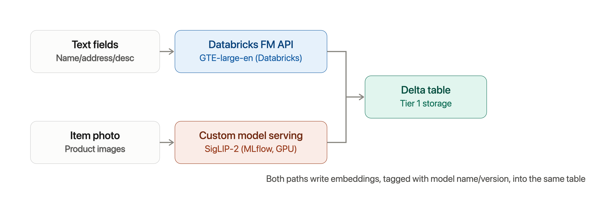

# Proposal: Embedding Model Selection for Retail Identity Resolution (IDR)

**Status:** Draft for stakeholder review
**Owner:** [Your name]
**Audience:** Engineering leadership, Data Science, Business stakeholders
**Date:** 2026-07-15
**Related:** Vector Storage Tiered Plan (Databricks) — companion proposal

## 1. Executive summary

We ran an internal experiment to test whether combining text and image embeddings ("cross-modal fusion") produces better product/customer matching than using any single signal alone. The experiment used open-source models (Sentence-Transformers for text, OpenAI CLIP for images) on a sample retail catalog and compared five embedding strategies using clustering-quality metrics.

**Recommendation:** Do not train a custom embedding model from scratch. The multimodal embedding space is mature and well-served by existing pretrained models. We recommend a **hybrid, off-the-shelf approach**:

- Use a **Databricks-hosted text embedding model** (Foundation Model APIs) for name/description/address text — no infrastructure to manage, governed, billed pay-per-token.
- Use a **pretrained open-weight multimodal (text+image) encoder**, deployed as a Databricks Model Serving endpoint, for the image and cross-modal fusion component — since Databricks does not yet host a multimodal encoder natively.
- Reserve **custom model training/fine-tuning** as a later-phase optimization, only if the off-the-shelf models underperform on our specific retail data (e.g., private-label products, in-house photography style) after we've measured that gap.

This keeps us on Databricks-native infrastructure end-to-end (Spark/PySpark, Unity Catalog, Model Serving, Vector Search) with no new vendor procurement required to get started.

## 2. What we tested (experiment summary)

Using a sample of the Amazon Berkeley Objects (ABO) retail catalog (item title, description/bullet points, and product image), we generated five embedding variants per item:

| Variant | Method | What it captures |
|---|---|---|
| `name` | Sentence-Transformer (`all-MiniLM-L6-v2`) on item title | Text only |
| `description` | Same model on bullet-point description | Text only |
| `image` | CLIP (ViT-B/32) image encoder | Image only |
| `combined` | Concatenation of the three vectors above | All signals, **no cross-modal mixing** |
| `cross_embedding` | CLIP text encoder (title+description as one prompt) concatenated with CLIP image encoder | All signals, **with cross-modal mixing** — text and image share CLIP's contrastively-trained joint space |

We then clustered each variant with K-Means (k = number of true product types) and scored against ground-truth product type using ARI, silhouette score, homogeneity/V-measure, and intra-cluster cohesion.

**Purpose of the experiment:** confirm the hypothesis that a *jointly-aligned* text+image representation (`cross_embedding`) outperforms both single-modality embeddings and naive concatenation (`combined`), before committing engineering effort to productionizing a specific model choice.

> **[Insert final metrics table from `clustering_results/embeddings_clustering_metrics.json` here before circulating — e.g. ARI/silhouette/V-measure per variant — so stakeholders see the actual numbers, not just the design.]**

**Why this matters for IDR specifically:** the same principle applies to identity resolution. A customer record is itself multimodal — name text, address text, and (potentially) receipt/loyalty-card images. A jointly-aligned embedding space is expected to link "the same customer expressed differently across channels" more reliably than scoring each field independently and combining scores after the fact.

## 3. Requirements for the production embedding model(s)

| Requirement | Why it matters |
|---|---|
| Runs in/near Databricks (PySpark-callable, batchable) | Our pipelines are Databricks-native end to end; anything else adds a data-egress and orchestration burden |
| Supports both text and image inputs in a shared space | Core to the cross-modal advantage shown in the experiment |
| No training data required to get started | We don't yet have a large, labeled retail-specific dataset for contrastive training |
| Commercially licensed for our use case | Some open-weight embedding models carry non-commercial or attribution license terms — must be checked per model before adoption |
| Reasonable dimensionality | Directly affects Tier-1 storage cost and Tier-2 Vector Search index size (see companion vector storage proposal) |
| Versioned / reproducible | Embeddings must be regenerated consistently as data updates; model name + version already tracked in our storage schema |

## 4. Build vs. buy

| | Train a custom model | Use pretrained, off-the-shelf models |
|---|---|---|
| Time to first result | Months (data collection, labeling, training, evaluation) | Days–weeks (already demonstrated in our experiment) |
| Cost | GPU training time + ML engineering effort + ongoing maintenance | Inference-only cost (Databricks Foundation Model APIs pay-per-token, or a small serving endpoint for the image model) |
| Data requirement | Needs a large, labeled, retail-specific paired text/image dataset we do not currently have | None — pretrained on large public + commercial datasets |
| Risk | High — models like CLIP were trained on hundreds of millions of image-text pairs; matching that from scratch on a smaller proprietary dataset is unlikely to beat pretrained baselines early on | Low — this is a well-solved problem; we are very unlikely to be the first team with this exact use case |
| Upside | Only pays off once we've proven the pretrained approach has a specific, measurable gap on our data | Can capture 80–90% of the benefit immediately, informs *whether* custom training is even worth pursuing later |

**Recommendation:** start with off-the-shelf models. If evaluation later reveals a specific, quantified gap (e.g., poor performance on our private-label product photography, or on informal/misspelled name variants unique to our customer base), consider **light-touch fine-tuning** (e.g., LoRA adapters on top of a pretrained encoder) rather than training from scratch. Full from-scratch training should not be on the roadmap for this initiative.

## 5. Candidate models

### Text embeddings (name, address, description)

| Model | Source | Databricks integration | Notes |
|---|---|---|---|
| **GTE-large-en / BGE-large-en** | Databricks Foundation Model APIs | Native — hosted serving endpoint, pay-per-token, queryable via SQL/`ai_query`, PySpark, or REST | Currently used as the default text embedding option in Databricks Vector Search |
| **Qwen3-Embedding-0.6B** | Databricks Foundation Model APIs | Native — hosted, serverless GPU, designed for retrieval/agentic workloads, directly selectable for Vector Search indexes | First multilingual embedding model on Databricks FM APIs; worth considering if we expect multilingual customer names/addresses |
| `all-MiniLM-L6-v2` (used in our experiment) | Self-hosted via `sentence-transformers` | Manual — must load/run inside our own job/cluster | Fine for prototyping; no reason to keep self-hosting once a Databricks-hosted equivalent is available and governed |

**Recommendation:** move production text embeddings to a **Databricks-hosted Foundation Model API** (start with GTE-large-en; evaluate Qwen3-Embedding-0.6B if multilingual support matters) rather than continuing to self-host `sentence-transformers` in a job. Removes a dependency we have to patch/maintain and puts text embedding generation on governed, serverless infrastructure with no cluster to size.

### Multimodal (text + image) embeddings

| Model | License posture | Notes |
|---|---|---|
| **CLIP ViT-B/32 / ViT-L/14** (used in our experiment) | Open, permissive | Original cross-modal baseline; well understood, huge ecosystem, but lower accuracy than newer models |
| **SigLIP-2** (Google) | Open weights | Currently the strongest fully open model for image-text similarity; good default upgrade path from CLIP |
| **Jina CLIP v2** | Open weights, *license terms must be verified before use* | Adds multilingual text support and long-context (8K token) text encoding; strong image-to-text retrieval |
| **Voyage Multimodal 3.5** | Commercial API only, no self-hostable weights | Strong benchmark performance but introduces an external vendor dependency outside Databricks |
| **Qwen3-VL-Embedding** | Open weights | Very strong on cross-modal benchmarks; larger model, higher serving cost |

**Recommendation:** replace the CLIP ViT-B/32 baseline used in the experiment with **SigLIP-2** (or benchmark it against Jina CLIP v2, pending a license check) for the production cross-modal component. Package it as an MLflow `pyfunc` model and deploy to a **Databricks Model Serving** GPU endpoint, called from Spark via a pandas UDF or the serving REST API — this is the same architecture our experiment script already uses (load model once, batch-encode), just moved from an ad hoc script into a governed, reusable serving endpoint instead of a one-off job.

Databricks does not currently host a multimodal encoder natively through Foundation Model APIs (those are text-only today), so this piece will be a **self-managed Model Serving deployment** rather than a fully out-of-the-box endpoint — still "off-the-shelf" in the sense that we are not training anything, just hosting a pretrained open model ourselves.

## 6. Proposed architecture (fits the existing Tiered Vector Storage plan)

Both paths write into the same Delta-native embedding tables proposed in the vector storage plan, tagged with `model_name`/`model_version`, so swapping either model later is a re-embed job, not a re-architecture.

## 7. Risks and open questions

1. **Licensing:** confirm commercial-use terms for whichever multimodal model we choose (some carry non-commercial or attribution clauses) before it touches production data.
2. **Domain gap:** public multimodal models are trained on general web images; our product photography and address/name formats are domain-specific. We should measure this gap with real metrics (extending the experiment) before assuming off-the-shelf accuracy is "good enough" for IDR decisioning, not just clustering demos.
3. **PII handling:** name-on-card and address embeddings are quasi-PII regardless of which model produces them — governance requirements from the companion vector storage proposal apply unchanged here.
4. **Serving cost for the image/cross-modal model:** unlike the text embeddings (pay-per-token, Databricks-hosted), the multimodal encoder requires a GPU serving endpoint we manage — cost should be sized based on expected item/customer volume before committing.
5. **Model version drift:** need a process for re-embedding historical data when we upgrade the underlying model (e.g., CLIP → SigLIP-2), since old and new vectors are not directly comparable.

## 8. Recommended next steps

1. Re-run the existing experiment (`embeddings.py` / `clustering.py`) substituting the Databricks-hosted text model and SigLIP-2 for the image/cross-modal component, on the same evaluation set, to get an apples-to-apples comparison against the current CLIP/MiniLM baseline.
2. Extend the evaluation from product clustering (proxy task) to an actual IDR proxy task — e.g., known duplicate/linked customer pairs — since clustering by product type validates the *mechanism*, not the *IDR use case* directly.
3. Deploy the chosen multimodal model as an MLflow pyfunc on Databricks Model Serving; wire text embeddings to Foundation Model APIs.
4. Feed outputs into Tier 1 of the vector storage plan and proceed with the exit criteria defined there before considering Databricks Vector Search (Tier 2).
